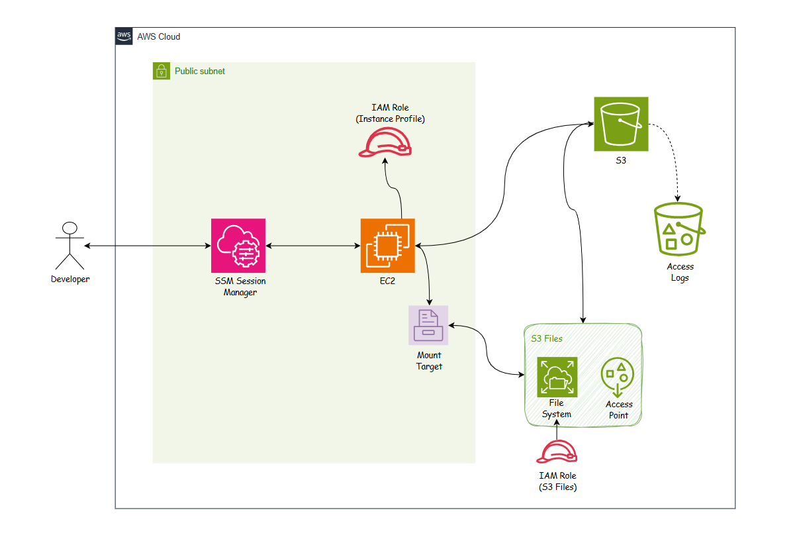

# S3 Files + EC2 Lab — Infraestrutura como Código com Terraform

> **Laboratório prático** de provisionamento automatizado de infraestrutura AWS usando Terraform, demonstrando integração entre Amazon S3 Files (sistema de arquivos elástico), EC2 e automação via GitHub Actions.

## 📋 Índice

- [Visão Geral](#-visão-geral)
- [Arquitetura](#-arquitetura)
- [O que é Amazon S3 Files?](#-o-que-é-amazon-s3-files)
- [Pré-requisitos](#-pré-requisitos)
- [Estrutura do Projeto](#-estrutura-do-projeto)
- [Configuração Inicial](#-configuração-inicial)
- [Deploy Local](#-deploy-local)
- [Deploy via GitHub Actions](#-deploy-via-github-actions)
- [Acessando a Instância EC2](#-acessando-a-instância-ec2)
- [Testando o S3 Files](#-testando-o-s3-files)
- [Recursos Criados](#-recursos-criados)
- [Troubleshooting](#-troubleshooting)
- [Limpeza](#-limpeza)

## Visão Geral

Este projeto demonstra como provisionar uma infraestrutura completa na AWS usando **Terraform** e **GitHub Actions**, incluindo:

-  **Amazon S3 Files** — Sistema de arquivos elástico montado via NFS que sincroniza automaticamente com S3
-  **EC2 Instance** — Servidor Linux (Amazon Linux 2023) com acesso via SSM Session Manager (sem SSH)
-  **Automação CI/CD** — Deploy e destroy automatizados via GitHub Actions
-  **Estado Remoto** — Backend S3 + DynamoDB para gerenciamento de estado do Terraform
-  **Segurança** — Criptografia, políticas TLS-only, IMDSv2, Security Groups restritos

### 💡 Casos de Uso

- Compartilhamento de arquivos entre múltiplas instâncias EC2
- Backup automático de dados para S3 com acesso via sistema de arquivos
- Migração de workloads NFS para a nuvem
- Laboratório de aprendizado de Terraform + AWS

## 🏗️ Arquitetura



### Fluxo de Funcionamento

```
┌─────────────────────────────────────────────────────────────────┐
│                         AWS Cloud (us-east-2)                    │
│                                                                   │
│  ┌─────────────────────────────────────────────────────────┐   │
│  │                    VPC (10.0.0.0/16)                     │   │
│  │                                                           │   │
│  │  ┌──────────────────┐         ┌──────────────────┐      │   │
│  │  │  Subnet A (AZ-a) │         │  Subnet B (AZ-b) │      │   │
│  │  │                  │         │                  │      │   │
│  │  │  ┌────────────┐  │         │  ┌────────────┐  │      │   │
│  │  │  │ EC2 Instance│◄─┼─────────┼─►│Mount Target│  │      │   │
│  │  │  │  (AL2023)   │  │  NFS    │  │  (Port 2049)│  │      │   │
│  │  │  └─────┬──────┘  │  2049   │  └──────┬─────┘  │      │   │
│  │  │        │         │         │         │        │      │   │
│  │  │   /mnt/s3files   │         │    S3 Files      │      │   │
│  │  │        │         │         │    File System   │      │   │
│  │  └────────┼─────────┘         └─────────┼────────┘      │   │
│  │           │                             │               │   │
│  └───────────┼─────────────────────────────┼───────────────┘   │
│              │                             │                   │
│              │                             ▼                   │
│              │                    ┌─────────────────┐          │
│              │                    │   S3 Bucket     │          │
│              │                    │  (Versioning +  │          │
│              │                    │   Encryption)   │          │
│              │                    └─────────────────┘          │
│              │                                                  │
│              ▼                                                  │
│     ┌─────────────────┐                                        │
│     │  SSM Session    │  (Acesso sem SSH via HTTPS)            │
│     │    Manager      │                                        │
│     └─────────────────┘                                        │
│                                                                 │
└─────────────────────────────────────────────────────────────────┘
         ▲
         │
    ┌────┴─────┐
    │ Developer │  (terraform apply / GitHub Actions)
    └──────────┘
```

### 🔄 Como Funciona

1. **Terraform** provisiona todos os recursos na AWS
2. **S3 Bucket** é criado com versionamento, criptografia SSE-AES256 e política TLS-only
3. **S3 Files File System** é vinculado ao bucket via IAM role com permissões mínimas
4. **Mount Targets** são criados em cada AZ suportada, expondo o sistema de arquivos via NFS (porta 2049)
5. **EC2 Instance** monta automaticamente o S3 Files em `/mnt/s3files` via `/etc/fstab`
6. **Arquivos escritos** em `/mnt/s3files` são sincronizados para o S3 em +-1 minuto
7. **Acesso SSH-free** via AWS Systems Manager Session Manager (sem chaves, sem bastion)

---

## 📦 O que é Amazon S3 Files?

**Amazon S3 Files** é um serviço gerenciado que fornece um sistema de arquivos elástico e escalável, montável via NFS, que sincroniza automaticamente com o Amazon S3.

### Características Principais

| Característica | Descrição |
|---|---|
| **Protocolo** | NFS v4.1 (porta 2049) |
| **Sincronização** | Bidirecional com S3 em +-1 minuto |
| **Escalabilidade** | Cresce/diminui automaticamente conforme necessidade |
| **Durabilidade** | 99.999999999% (11 nines) — mesma do S3 |
| **Casos de Uso** | Compartilhamento de arquivos, backup, migração de NFS legado |
---

## ✅ Pré-requisitos

### 1. Ferramentas Necessárias

| Ferramenta | Versão Mínima | Instalação |
|---|---|---|
| **Terraform** | >= 1.5.0 | [Download](https://www.terraform.io/downloads) |
| **AWS CLI** | >= 2.0 | [Download](https://aws.amazon.com/cli/) |
| **Session Manager Plugin** | Última | [Download](https://docs.aws.amazon.com/systems-manager/latest/userguide/session-manager-working-with-install-plugin.html) |
| **Git** | Qualquer | [Download](https://git-scm.com/) |

### 2. Credenciais AWS

Configure suas credenciais AWS localmente:

```bash
aws configure
```

Ou exporte as variáveis de ambiente:

```bash
export AWS_ACCESS_KEY_ID="sua-access-key"
export AWS_SECRET_ACCESS_KEY="sua-secret-key"
export AWS_DEFAULT_REGION="us-east-2"
```

### 3. Permissões IAM Necessárias

Sua conta/usuário IAM precisa das seguintes permissões:

- `ec2:*` — Criar instâncias, security groups, etc.
- `s3:*` — Criar buckets, objetos, políticas
- `elasticfilesystem:*` — Criar S3 Files file systems
- `iam:*` — Criar roles e policies
- `ssm:*` — Acesso via Session Manager

> 💡 **Dica:** Para ambientes de teste, você pode usar a policy `AdministratorAccess`, mas em produção use permissões mais restritas.

### 4. Infraestrutura Pré-existente

Você precisa ter:

-  **VPC** com pelo menos 2 subnets em AZs diferentes
-  **Internet Gateway** anexado à VPC (para acesso SSM)
-  **Bucket S3** para estado remoto do Terraform (backend)

#### Criar Backend do Terraform (se não tiver)

```bash
# Criar bucket para state file
aws s3api create-bucket \
  --bucket seu-bucket-terraform-state \
  --region us-east-2

# Habilitar versionamento
aws s3api put-bucket-versioning \
  --bucket seu-bucket-terraform-state \
  --versioning-configuration Status=Enabled
```

## 📁 Estrutura do Projeto

```
s3files-lab/
├── .github/
│   └── workflows/
│       ├── terraform-deploy.yml    # CI/CD: Plan no PR, Apply no push para main
│       └── terraform-destroy.yml   # CI/CD: Destroy manual com confirmação
│
├── infra/
│   ├── modules/
│   │   ├── s3/                     # Módulo: Bucket S3 + logs + políticas
│   │   │   ├── main.tf
│   │   │   ├── variables.tf
│   │   │   └── outputs.tf
│   │   │
│   │   ├── s3files/                # Módulo: File system + mount targets
│   │   │   ├── main.tf
│   │   │   ├── variables.tf
│   │   │   └── outputs.tf
│   │   │
│   │   └── ec2/                    # Módulo: Instância EC2 + IAM + SG
│   │       ├── main.tf
│   │       ├── variables.tf
│   │       └── outputs.tf
│   │
│   ├── main.tf                     # Configuração principal + backend S3
│   ├── variables.tf                # Definição de variáveis
│   ├── outputs.tf                  # Outputs (IDs, comandos úteis)
│   └── terraform.tfvars.example    # Valores das variáveis
│
├── .gitignore
├── README.md                       # Documentação original
├── README-Q.md                     # Esta documentação completa
└── s3files_architecture.png        # Diagrama de arquitetura
```

### Módulos Terraform

| Módulo | Responsabilidade | Recursos Criados |
|---|---|---|
| **s3** | Armazenamento | S3 bucket, bucket de logs, políticas, lifecycle rules |
| **s3files** | Sistema de arquivos | File system, mount targets, access point, IAM role |
| **ec2** | Computação | Instância EC2, IAM role, instance profile, security group |

## ⚙️ Configuração Inicial

### 1. Clonar o Repositório

```bash
git clone https://github.com/seu-usuario/s3files-lab.git
cd s3files-lab
```

### 2. Configurar Backend do Terraform

Edite `infra/main.tf` e ajuste o backend S3:

```hcl
terraform {
  backend "s3" {
    bucket         = "seu-bucket-terraform-state"  # ← Altere aqui
    key            = "s3files-lab/terraform.tfstate"
    region         = "us-east-2"
  }
}
```

### 3. Criar `terraform.tfvars`

Crie o arquivo `infra/terraform.tfvars` com seus valores:

```hcl
# Identificação do projeto
project     = "s3files-lab"

# Região AWS
aws_region = "us-east-2"

# Rede (substitua pelos seus IDs)
vpc_id   = "vpc-1234xxxxxx"
vpc_cidr = "10.0.0.0/16"

# Subnets (primeira será usada para EC2)
subnet_ids = [
  "subnet-xxxxxxxxxxxxx",  # us-east-2a
  "subnet-xxxxxxxxxxxxx"   # us-east-2b
]

# Subnets para mount targets (apenas AZs suportadas)
mount_target_subnet_ids = [
  "subnet-xxxxxxxxx"   # us-east-2a
]

# Tipo de instância EC2
instance_type = "t3.micro"
```

> ⚠️ **Importante:** Nem todas as AZs suportam S3 Files mount targets. Se receber erro `Mount targets are not supported in the provided subnet's availability zone`, remova essa subnet de `mount_target_subnet_ids`.

### 4. Descobrir IDs da sua VPC

Se você não sabe os IDs da sua VPC/subnets:

```bash
# Listar VPCs
aws ec2 describe-vpcs --query 'Vpcs[*].[VpcId,CidrBlock,Tags[?Key==`Name`].Value|[0]]' --output table

# Listar subnets de uma VPC
aws ec2 describe-subnets \
  --filters "Name=vpc-id,Values=vpc-XXXXXXXX" \
  --query 'Subnets[*].[SubnetId,AvailabilityZone,CidrBlock]' \
  --output table
```

## 🚀 Deploy Local

### 1. Inicializar Terraform

```bash
cd infra
terraform init
```

**Saída esperada:**
```
Initializing the backend...
Successfully configured the backend "s3"!

Initializing modules...
- ec2 in ./modules/ec2
- s3 in ./modules/s3
- s3files in ./modules/s3files

Terraform has been successfully initialized!
```

### 2. Validar Configuração

```bash
terraform validate
```

### 3. Planejar Mudanças

```bash
terraform plan
```

Revise o plano e confirme que os recursos corretos serão criados (+-15-20 recursos).

### 4. Aplicar Infraestrutura

```bash
terraform apply
```

Digite `yes` quando solicitado.

**Tempo estimado:** 3-5 minutos

### 5. Capturar Outputs

Após o apply, você verá outputs importantes:

```bash
terraform output
```

**Exemplo de saída:**

```hcl
bucket_id            = "s3files-lab-bucket-abc123"
ec2_instance_id      = "i-0123456789abcdef0"
ec2_private_ip       = "10.0.1.50"
file_system_id       = "fs-0123456789abcdef0"
mount_target_ids     = {
  "subnet-0123456789abcdef0" = "fsmt-0123456789abcdef0"
}
ssm_connect_command  = "aws ssm start-session --target i-0123456789abcdef0 --region us-east-2"
mount_command        = "sudo mount -t s3files fs-0123456789abcdef0:/ /mnt/s3files"
```


## 🤖 Deploy via GitHub Actions

### 1. Configurar Secrets no GitHub

Vá em `Settings > Secrets and variables > Actions` e adicione:

| Secret | Valor |
|---|---|
| `AWS_ACCESS_KEY_ID` | Sua AWS Access Key |
| `AWS_SECRET_ACCESS_KEY` | Sua AWS Secret Key |

### 2. Workflows Disponíveis

#### **Deploy e Destroy Automático** (`terraform-deploy.yml`)

- **Push para `main`** → Roda `terraform apply` automaticamente
- E depois no Actions do Github quando selecionado esse workflow você pode optar por deploy ou destroy

⚠️ O arquivo `.github/workflows/terraform-deploy.yml` está comentado por padrão.
> Descomente-o após configurar os secrets acima.

## 🔐 Acessando a Instância EC2

### Via SSM Session Manager (Recomendado)

Não precisa de chave SSH, bastion host ou IP público exposto.

```bash
# Copie o comando do output
terraform output ssm_connect_command

# Ou execute diretamente
aws ssm start-session --target i-XXXXXXXXX --region us-east-2
```

**Aguarde 60-90 segundos** após o `terraform apply` para o agente SSM se registrar.

### Verificar Status do Agente SSM

```bash
aws ssm describe-instance-information \
  --filters "Key=InstanceIds,Values=i-XXXXXXXXX" \
  --query "InstanceInformationList[0].PingStatus"
```

Se retornar `"Online"`, você pode conectar.

## 🧪 Testando o S3 Files

### 1. Conectar à Instância

```bash
aws ssm start-session --target i-XXXXXXXXX --region us-east-2
```

### 2. Verificar Montagem

```bash
# Verificar se está montado
mount | grep s3files

# Saída esperada:
# fs-0123456789abcdef0:/ on /mnt/s3files type s3files (rw,relatime,...)

# Caso sem nenhuma saída, execute o seguinte comando e valide novamente se está montado
sudo mount -a

# Ver configuração do fstab
cat /etc/fstab | grep s3files
```

### 3. Criar Arquivos

O S3 Files monta com propriedade `root` por padrão. Use `sudo`:

```bash
# Criar arquivo de teste
sudo sh -c 'echo "Hello from EC2 to S3 Files!" > /mnt/s3files/teste-s3files.txt'

# Ler arquivo
cat /mnt/s3files/teste-s3files.txt

# Criar diretório e copiar arquivo
sudo mkdir /mnt/s3files/my-folder
sudo cp /mnt/s3files/test.txt /mnt/s3files/my-folder/

# Listar conteúdo
ls -lah /mnt/s3files/
```

### 4. Instalando o FFmpeg no Amazon Linux 2023 Para Teste de Conversão Arquivo MP4 para MP3 

No Amazon Linux 2023, o `ffmpeg` não está disponível nos repositórios padrão. Instale via binário estático:

```bash
# 1. Dependências
sudo dnf install -y wget tar xz

# 2. Download
sudo wget https://johnvansickle.com/ffmpeg/releases/ffmpeg-release-amd64-static.tar.xz

# 3. Extrair e instalar
sudo tar -xvf ffmpeg-release-amd64-static.tar.xz
cd ffmpeg-*-static
sudo cp ffmpeg ffprobe /usr/local/bin/

# 4. Validar
ffmpeg -version
```
Crie um diretório novo no bucket
```bash
sudo mkdir /mnt/s3files/media/
```
Após isso adicione no bucket um arquivo **.mp4**, feito o upload volte para o terminal e execute:
```bash
ffmpeg -i /mnt/s3files/nome-do-arquivo.mp4 /mnt/s3files/nome-do-arquivo.mp3
```
### 5. Verificar Sincronização com S3

Aguarde +-1 minuto e verifique no S3:

```bash
# Via CLI
aws s3 ls s3://seu-bucket-name/

# Saída esperada:
# 2024-01-15 10:30:00         16 test.txt
#                            PRE my-folder/
```

Ou acesse o console AWS: **S3 > seu-bucket > Objects**

### 5. Testar Sincronização Reversa (S3 → File System)

```bash
# Faça o upload de um arquivo diretamente no console do S3
# Criar arquivo diretamente no S3
echo "Hello from S3!" | aws s3 cp - s3://seu-bucket-name/from-s3.txt

# Aguardar +-1 minuto e verificar no file system
cat /mnt/s3files/from-s3.txt
# Hello from S3!
```

## 📦 Recursos Criados

### Resumo Completo

| Recurso | Nome/ID | Descrição |
|---|---|---|
| **S3 Bucket** | `{project}-{env}-bucket-{random}` | Bucket principal com versionamento + criptografia |
| **S3 Bucket (Logs)** | `{project}-{env}-logs-{random}` | Bucket para server access logs |
| **S3 Files File System** | `fs-XXXXXXXXX` | Sistema de arquivos elástico vinculado ao bucket |
| **Mount Targets** | `fsmt-XXXXXXXXX` | Um por subnet/AZ, porta NFS 2049 |
| **Access Point** | `fsap-XXXXXXXXX` | Ponto de entrada específico da aplicação |
| **EC2 Instance** | `i-XXXXXXXXX` | Amazon Linux 2023, t3.micro, IP público |
| **IAM Role (S3 Files)** | `{project}-{env}-s3files-role` | Assumida por `elasticfilesystem.amazonaws.com` |
| **IAM Role (EC2)** | `{project}-{env}-ec2-role` | SSM + S3 Files client + leitura direta S3 |
| **Security Group (EC2)** | `{project}-{env}-ec2-sg` | Egress only (sem ingress) |
| **Security Group (Mount)** | `{project}-{env}-mount-sg` | Ingress NFS 2049 do CIDR da VPC |

### Políticas de Segurança Aplicadas

**S3 Bucket:**
- Versionamento habilitado
- Criptografia SSE-AES256 (server-side)
- Política TLS-only (rejeita HTTP)
- Lifecycle: versões não-atuais expiram em 90 dias
- Server access logging habilitado

**EC2 Instance:**
- IMDSv2 obrigatório (metadata service v2)
- Volume raiz criptografado
- Sem chave SSH (acesso via SSM)
- Security group sem ingress (apenas egress)

**IAM Roles:**
- Princípio do menor privilégio
- Políticas inline específicas
- Sem credenciais hardcoded


## 🔧 Troubleshooting

### Problema: Mount target não suportado na AZ

**Erro:**
```
Error: Mount targets are not supported in the provided subnet's availability zone
```

**Solução:**
Remova a subnet problemática de `mount_target_subnet_ids` no `terraform.tfvars`.

---

### Problema: SSM Session Manager não conecta

**Erro:**
```
An error occurred (TargetNotConnected) when calling the StartSession operation
```

**Causas possíveis:**

1. **Agente SSM ainda não registrou** → Aguarde 60-90 segundos após o `terraform apply`
2. **Sem rota para Internet Gateway** → Verifique route table da subnet
3. **Security group bloqueando egress HTTPS** → Verifique regras de saída

**Verificar status:**
```bash
aws ssm describe-instance-information \
  --filters "Key=InstanceIds,Values=i-XXXXXXXXX"
```


### Problema: Arquivos não sincronizam com S3

**Causas possíveis:**

1. **Aguardar tempo de sincronização** → Pode levar até 1 minuto
2. **IAM role sem permissões** → Verificar role do S3 Files
3. **Bucket policy bloqueando** → Verificar políticas do bucket

**Verificar logs:**
```bash
# Na instância EC2
sudo tail -f /var/log/messages | grep s3files
```

## 🧹 Limpeza

### Via Terraform (Local)

```bash
cd infra
terraform destroy
```

Digite `yes` quando solicitado.

**O que acontece:**
1. Provisioner de destruição exclui mount targets
2. Exclui o file system S3 Files
3. Esvazia todos os objetos versionados do bucket
4. Exclui buckets S3
5. Termina instância EC2
6. Remove security groups, IAM roles, etc.

### Via GitHub Actions

1. Vá em `Actions > Terraform Deploy`
2. Clique em `Run workflow`
3. Selecione `destroy`
4. Digite `destroy` no campo de confirmação
5. Clique em `Run workflow`

### Verificar Limpeza

```bash
# Verificar se recursos foram removidos
aws ec2 describe-instances --filters "Name=tag:Project,Values=s3files-lab"
aws s3 ls | grep s3files-lab
aws efs describe-file-systems --query 'FileSystems[?Tags[?Key==`Project` && Value==`s3files-lab`]]'
```

## 📚 Referências

- [Amazon S3 Files Documentation](https://docs.aws.amazon.com/pt_br/AmazonS3/latest/userguide/s3-files.html)
- [Terraform AWS Provider](https://registry.terraform.io/providers/hashicorp/aws/latest/docs)
- [AWS Systems Manager Session Manager](https://docs.aws.amazon.com/systems-manager/latest/userguide/session-manager.html)

---

**Dúvidas?** [Me chame no LinkedIn!](https://linkedin.com/in/joão-gaioso)
